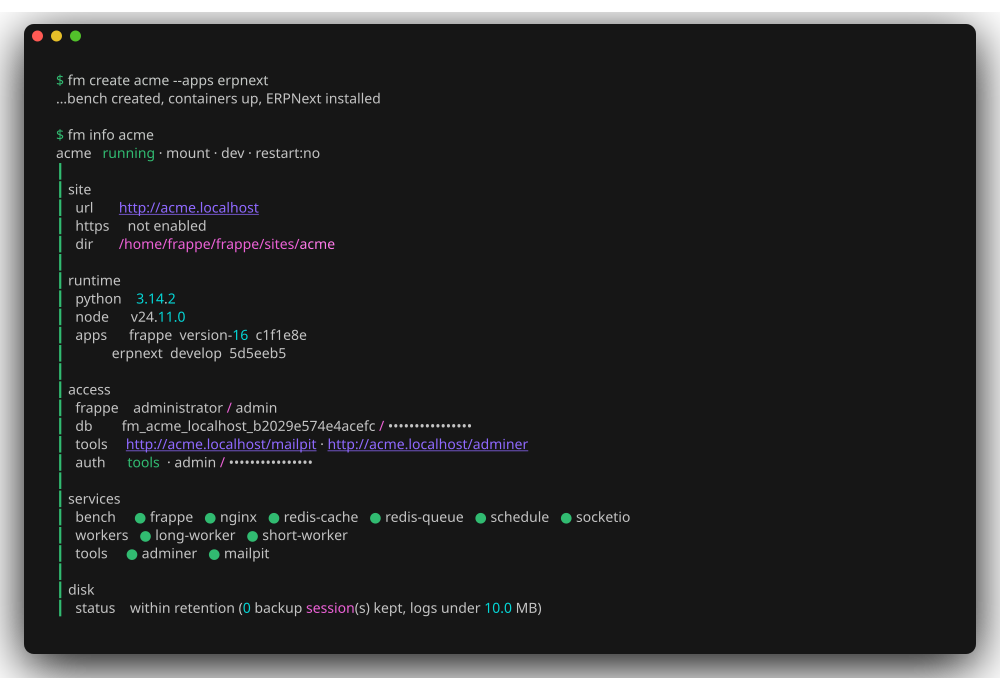

<div align="center">

# Frappe Manager

**Run Frappe benches on Docker: one command to create one, one to ship it.**

`fm` gives every Frappe bench its own containers, database, workers and web server, then takes it from a local `.localhost` URL to an HTTPS production deploy without you writing a compose file.

[](https://pypi.org/project/frappe-manager/) [](https://www.python.org/downloads/) [](../../actions/workflows/pytest.yml) [](https://opensource.org/licenses/MIT)

**[Documentation](https://opensource.rtcamp.com/Frappe-Manager/dev/)** · [Install](https://opensource.rtcamp.com/Frappe-Manager/dev/getting-started/installation/) · [Quick Start](https://opensource.rtcamp.com/Frappe-Manager/dev/getting-started/quick-start/) · [Commands](https://opensource.rtcamp.com/Frappe-Manager/dev/commands/) · [FAQ](https://opensource.rtcamp.com/Frappe-Manager/dev/faq/)

</div>



## Quick start

You need [Docker](https://docs.docker.com/get-docker/) running and Python 3.13.

```bash
# 1. install
uv tool install --python 3.13 frappe-manager

# 2. create a bench (add --apps erpnext for ERPNext)
fm create mybench

# 3. visit it
#    http://mybench.localhost
```

`fm create` builds the bench, starts it, and prints the URL and login. A bare name becomes a `.localhost` domain, so nothing to add to `/etc/hosts`. The default login is `Administrator` / `admin`.

Prefer pipx, want to try it without installing, or need a dev build? See the [Installation guide](https://opensource.rtcamp.com/Frappe-Manager/dev/getting-started/installation/).

## What you get

| Capability | What it means |
|---|---|
| **Isolated benches** | Each bench owns its containers, apps and database, and several run side by side on one host. `fm list` shows them all. |
| **Dev or prod, per bench** | `dev` mounts an editable workspace with admin tools on; `prod` runs lean behind the shared proxy. Switch with `fm update -e`. |
| **Any Frappe app** | Install ERPNext, HRMS or your own repo with `--apps`, pinned to a branch, tag or commit. |
| **HTTPS in one command** | `fm ssl add` issues a Let's Encrypt certificate over HTTP-01 or DNS-01; `fm ssl renew all` is cron-safe. |
| **VS Code, attached** | `fm code mybench` opens the bench inside its running container, `--debugger` adds the Frappe debug config. |
| **Immutable deploys** | `fm bake` builds an image of the bench, `fm switch` swaps onto it with a rolling web swap, `fm switch --previous` rolls back. |
| **Batteries for debugging** | Adminer and Mailpit path-routed under the bench URL, behind basic auth, on by default for `dev`. |
| **Scriptable** | Every command takes `-n` for non-interactive use and `--json` for one JSON line per output event. |

## Commands

`fm` groups its commands by what you address: a bench, one site in a bench, a domain, or the host.

```bash
fm create mybench --apps erpnext     # create a bench and install apps
fm start mybench                     # start, stop, restart it
fm info mybench                      # URL, credentials, apps, deploy history
fm shell mybench                     # a shell in the frappe container
fm ssl add mybench/example.com       # HTTPS for a domain it serves
fm bake mybench                      # build an image of the bench
fm switch mybench local/mybench:TAG  # deploy onto it, rolling swap
fm switch mybench --previous         # roll back to the last image
```

Run `fm --help` for the grouped command list, or `fm <command> --help` for a command's options and worked examples. The [command reference](https://opensource.rtcamp.com/Frappe-Manager/dev/commands/) documents all of them.

## Documentation

| Section | What is in it |
|---|---|
| [Getting started](https://opensource.rtcamp.com/Frappe-Manager/dev/getting-started/installation/) | Install, prerequisites, and your first bench |
| [Guides](https://opensource.rtcamp.com/Frappe-Manager/dev/guides/) | SSL, apps, domains, external databases, VS Code, hosting |
| [Command reference](https://opensource.rtcamp.com/Frappe-Manager/dev/commands/) | Every command, flag and example |
| [Configuration](https://opensource.rtcamp.com/Frappe-Manager/dev/reference/configuration/) | Every key in `fm_config.toml` and `bench_config.toml` |
| [FAQ](https://opensource.rtcamp.com/Frappe-Manager/dev/faq/) | Common failures and how to get out of them |

Docs are versioned: [`/latest/`](https://opensource.rtcamp.com/Frappe-Manager/latest/) matches the released version you get from PyPI, [`/dev/`](https://opensource.rtcamp.com/Frappe-Manager/dev/) matches `develop`.

## Contributing and support

Issues and pull requests are welcome.

- [Report a bug or request a feature](../../issues)
- [Ask a question in Discussions](../../discussions)

Working on `fm` itself: clone the repo, `uv sync`, and run the CLI with `uv run fm`. `just test` runs the suite and `just docs` serves the documentation locally.

## Credits and license

Built on the official [Frappe Docker](https://github.com/frappe/frappe_docker) images, and maintained by [rtCamp](https://rtcamp.com/).

MIT, see [LICENSE](LICENSE).
