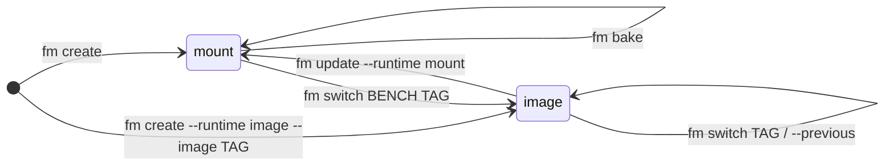

# Runtimes: Mount vs Image

The runtime is the most consequential property of a bench: it decides **where the code lives** and therefore what you can do with the bench.

| | `mount` (default) | `image` |
|---|---|---|
| Code lives in | an editable **workspace** on your disk, bind-mounted into the containers | an immutable **Docker image**, baked ahead of time |
| Change code by | editing files (changes are live) | building a new image (`fm bake`) and switching to it |
| Made for | development, simple servers | production: repeatable deploys, instant rollbacks |

## Mount: the editable workspace

```bash
fm create mybench                          # clone + install apps into a workspace
fm create mybench --from-image repo:tag    # or seed the workspace from a baked image (near-instant)
```

Your apps live at `~/frappe/sites/<bench>/workspace/frappe-bench/apps/`, a normal bench directory you can edit, commit from, and debug against. Everything code-related works here:

- `fm update --apps app:branch`: graft apps onto the bench (old code is stashed, never deleted)
- `fm update --python 3.12 --node 22`: swap toolchains (recreates the venv, reinstalls apps)
- `fm bake`: snapshot or freshly provision this bench into an immutable image

## Image: the immutable release

```bash
fm bake mybench                                  # build an image from a bench (prints the tag)
fm create prodbench --runtime image --image repo:tag   # or create a bench directly on a pre-built image
```

Code, venv, and built assets are inside the image; the bench only holds data (sites, DB, logs, config). There is nothing to edit, and that's the point:

- deploys are atomic and repeatable, and rollback is one command away; see [Deployment](../deploy/index.md) and [Rolling back](../deploy/rollback.md)
- `fm update` accepts settings only (SSL, domains, policies); `--apps`/`--python`/`--node` are refused, since those are baked in

The full pipeline (baking, zero-downtime rolling swaps, rollbacks with DB restore, release pruning) is covered in the [Deployment guide](../deploy/index.md).

## Moving between runtimes



Both directions preserve your site and database:

- **mount → image**: a one-time config edit (`runtime = "image"` + a top-level `image` repo in `bench_config.toml`), then `fm switch <bench> <tag>` runs the full deploy pipeline: the site is migrated onto the image and the workspace stops being the source of truth. The [Deployment guide](../deploy/index.md) walks through it.
- **image → mount** (demotion): `fm update <bench> --runtime mount` extracts an editable workspace from the *currently deployed* image; code on disk equals running code, so no migrate is needed; any stale workspace leftovers are stashed, never deleted.

The backing keys ([`runtime`](../reference/configuration.md#runtime), [`image` and friends](../reference/configuration.md#images)) are documented in the configuration reference.

## How runtime and environment combine

Runtime says where code lives; [environment](../guides/environments.md) says how the web process runs. All four combinations are valid; see the [Concepts overview](index.md) for the 2x2 matrix.

One flag worth knowing changes meaning with the runtime: on a mount bench `--image` overrides the *base* frappe image the workspace runs on; on an image bench it names the *app image to run*.

## Where to next

- Daily work on a mount bench → [Guides](../guides/index.md)
- Shipping an image bench → [Deployment](../deploy/index.md)
