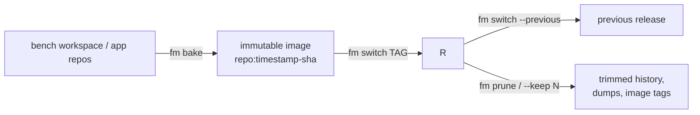
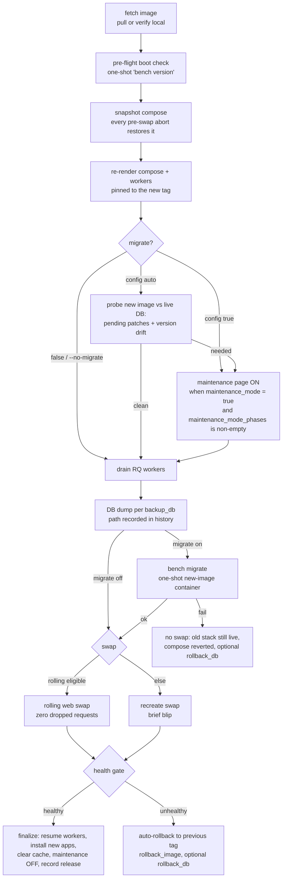
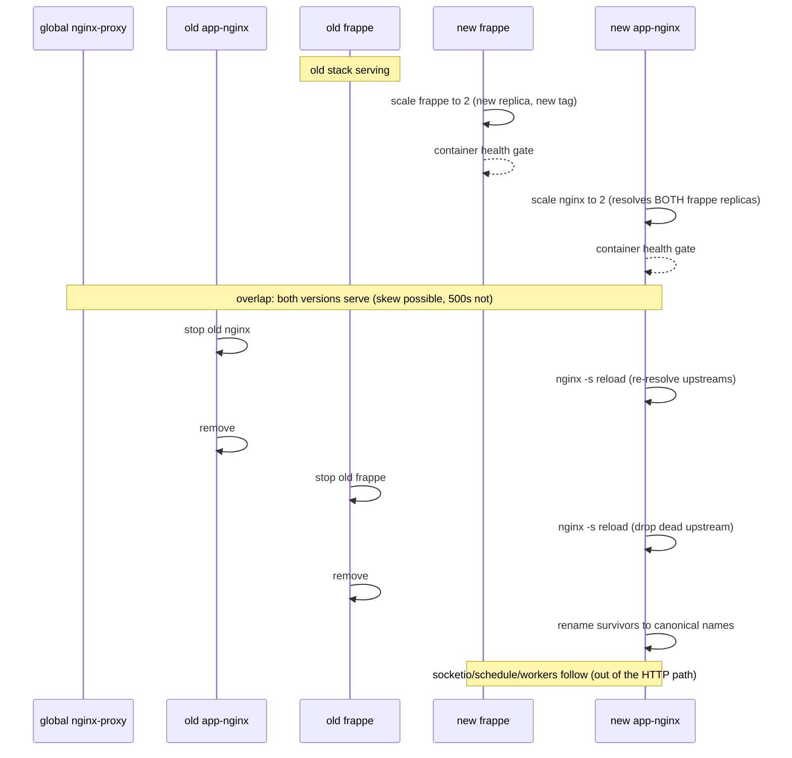

# Deployment

fm runs a bench in one of two **runtimes**:

| Runtime | What runs | For |
|---|---|---|
| `mount` | your editable workspace, bind-mounted into containers | development |
| `image` | an immutable, pre-built app image (code + venv + assets baked in) | production |

This section covers the image lifecycle: **bake** an image, **deploy** it, **roll back**, keep the release history **pruned**, and how fm moves traffic without dropping requests.

## Your first deploy

`fm bake`, `fm switch`, and `fm prune` operate on a bench in the **image runtime**, and all three run on the host that owns the bench. A `mount` bench (the default dev workspace) is converted once; after that, every release is a bake and a switch.

1. **One-time conversion** of your working mount bench (if you don't have one yet, the [Quick Start](../getting-started/quick-start.md) gets you there). Give the bench a release image repo and flip its runtime in `bench_config.toml`:

    ```toml
    image   = "local/mybench"   # where releases are tagged; a registry host prefix + [registry] enables push/pull
    runtime = "image"
    ```

2. **Bake the first image:**

    ```bash
    fm bake mybench
    ```

    A bake builds a **pair**: the app image `local/mybench:<timestamp>-<git sha>` (code, venv, assets) and `local/mybench-nginx:<same tag>`, which is the same tag with `-nginx` on the repo and carries the built bundles for the bench's nginx to serve. Only the app tag is ever named on the command line; fm derives the second one and the two travel, deploy and prune together.

3. **Switch onto it.** This is the conversion moment; the deploy pipeline migrates your existing site onto the image (site data and DB carry over):

    ```bash
    fm switch mybench local/mybench:<tag>
    ```

4. **Every release after that is bake then switch:**

    ```bash
    fm bake mybench --image local/mybench:v2
    fm switch mybench local/mybench:v2
    ```

    `--image` names the app image the bake produces: give it a full ref and the ref you bake is the ref you switch to; give it a bare repo, or leave it off and let the bench's `image` repo stand, and the bake generates and prints `local/mybench:<timestamp>-<git sha>` for you to pass along. (`--base-image REF` is the other direction: the image this one is built *from*.) The switch then runs the full pipeline, and you will see its steps in order: fetch, a pre-flight boot check, the compose re-pin, the migrate decision, the worker drain, the DB dump, the migrate, the swap, a health gate, and finalize. If anything fails before the swap, the old stack never stopped serving.

5. **Verify it:**

    ```bash
    fm info mybench
    ```

    The **deploys** section lists every release, newest first, with its migrate status and whether a DB dump was taken.

That's the whole loop. The rest of this page explains what happened underneath; the pages linked at the bottom cover [rolling back](rollback.md), [image transports and architectures](transports.md), and [every config key](../reference/configuration.md#deploy-tables).

!!! tip "Starting fresh in image runtime"
    A bench can also be *born* deployed: `fm create prodbench --runtime image --image <repo:tag>` creates the site directly from a pre-built image (baked elsewhere, e.g. CI via `fm bake --apps ... --image ... --push`). No conversion needed.

## The lifecycle at a glance



- `fm bake <bench> [--image REF] [--base-image REF]`: build the image pair only, deploying nothing (prints both tags). `--image` is the app image produced; `--base-image` is what it is built from, the command-line form of [`[build].base_image`](../reference/configuration.md#deploy-tables).
- `fm switch <bench> <tag>`: deploy an already-built tag (no bake).
- `fm switch <bench> --previous`: roll back (same pipeline pointed backwards, migrate disabled).
- `fm prune <bench>`: remove old releases; also available inline as `--keep N` on `fm switch`.

Every deploy is recorded in the bench's `bench_config.toml` under `[deploy_state]`: the current tag, the previous tag (the rollback target), the timestamp of the last successful deploy, and one history row per release carrying its tag, timestamp, migrate status (`migrated`, `skipped`, `failed` or `rollback`) and the path of the DB dump taken. `fm info <bench>` shows the whole history in its **deploys** section.

## The switch pipeline

Forward deploys and rollbacks are the *same pipeline* pointed at different tags:



Key properties:

- **Aborts are safe.** Any failure before the swap restores the compose snapshot, clears the maintenance page and resumes the RQ workers: the old stack never stopped serving, a later plain `compose up` cannot jump tags, and the bench is not left silently processing no background jobs. A failure *in* the swap unwinds the page and the workers the same way; the swap paths restore their own compose.
- **A failed migrate never swaps.** `bench migrate` is transactional/resumable, so the default is keep-old and re-run after fixing.
- **The DB dump is exact.** It is taken after the workers have drained (and, when a schema step put it up, with requests already on the maintenance page), so restoring it loses nothing that happened before the migrate.
- **Drain and dump are not migrate-only.** By default workers are drained and the DB dump is taken on every deploy, even with `--no-migrate`; if in-flight jobs do not finish within `[workers].drain_timeout` the deploy aborts before backup/migrate/swap (workers resumed, old stack still serving), so the dump is never taken while a worker is mid-write. Raise the timeout, or set `[workers].drain = false` to deploy without waiting at all, accepting that in-flight jobs die when the worker containers are replaced. The drain is tuned in the [`[workers]` table](../reference/configuration.md#workers) and `backup_db` (including its `"auto"` mode) in the [`[switch]` table](../reference/configuration.md#deploy-tables).

## The rolling web swap

When the version overlap is safe, fm runs old and new web replicas side by side and drains the old (zero dropped requests instead of the recreate blip):



The stop → reload → remove order exists because app-nginx resolves its `upstream frappe` once at config load: killing a replica without a reload would leave a dead IP that black-holes connections.

**When is rolling eligible?** (`--rolling`/`--no-rolling` overrides the rules)

| Situation | Swap |
|---|---|
| no migrate and no DB restore | rolling |
| `maintenance_mode_phases = []` (operator asserts the migration is additive; also skips the maintenance page) | rolling |
| migrate/restore **under** the maintenance page (both replicas serve the 503) | rolling |
| migrate/restore with the maintenance page disabled | recreate |

In every case rolling also needs the old web tier running to swap alongside; when nothing is serving, fm falls back to the recreate swap even if `--rolling` was passed (with a warning).

Honest caveat: rolling is zero-**downtime**, not zero-**skew**; during the overlap a request may see old assets with new code or vice-versa. Eligibility guarantees both versions are DB-compatible, so the skew cannot 500.

The same engine powers `fm restart --rolling`: a zero-downtime web-tier recreate on the *current* tag (fresh containers, no release change). It needs an image bench; on a mount bench web restarts already go through supervisor, which is faster.

## Releases, history, and pruning

```bash
fm info mybench          # deploys section: every release, newest first, with migrate status
fm prune mybench --dry-run
fm prune mybench --keep 3
fm switch mybench local/mybench:<tag> --keep 7   # prune inline after a successful switch (opt-in)
```

Pruning splits two concerns:

- **History rows** are audit lines: the newest N are kept (`--keep`, or [`[switch].keep_releases`](../reference/configuration.md#deploy-tables)).
- **Artifacts are refcounted**: a DB dump dir is deleted only when no kept row references it; an image tag (and its paired `-nginx` assets image) is removed only when neither a kept row nor the protected set (current, previous, seed, base) references it.

Nothing a running or rollback-reachable release needs can be pruned.

## Go deeper

<div class="grid cards" markdown>

-   :lucide-undo-2:{ .lg .middle } &nbsp; **[Rollback](rollback.md)**

    ---

    The 3am page: two commands to get back to the previous release, with or without the database.

-   :lucide-truck:{ .lg .middle } &nbsp; **[Transports & Platforms](transports.md)**

    ---

    Getting the image to where it runs: registry pulls, airgapped save/load, CI pipelines, and CPU architectures.

-   :lucide-settings-2:{ .lg .middle } &nbsp; **[Configuration](../reference/configuration.md#deploy-tables)**

    ---

    Every `[build]`, `[switch]`, and `[registry]` key with its default.

</div>
