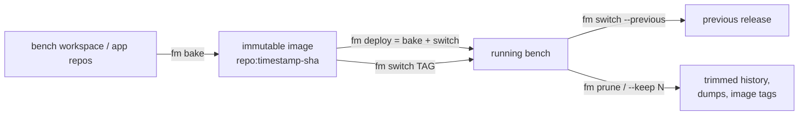
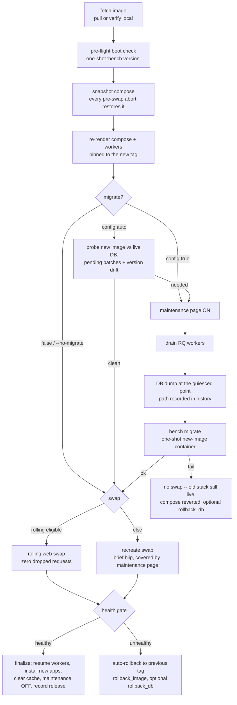
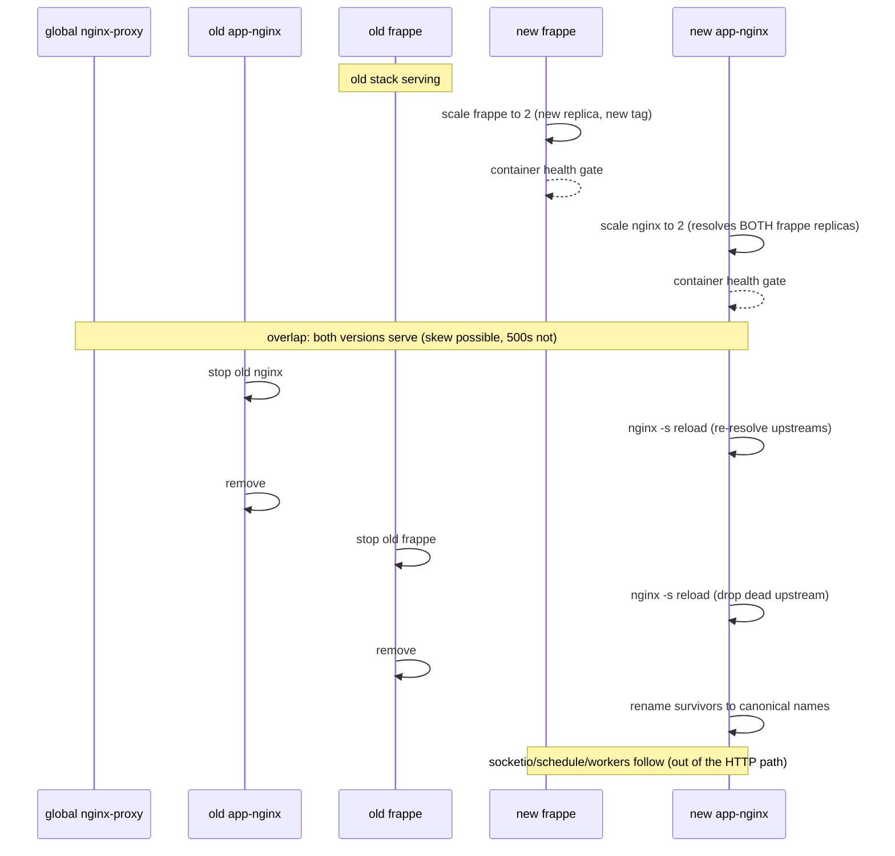

# Deployment

fm runs a bench in one of two **runtimes**:

| Runtime | What runs | For |
|---|---|---|
| `mount` | your editable workspace, bind-mounted into containers | development |
| `image` | an immutable, pre-built app image (code + venv + assets baked in) | production |

This section covers the image lifecycle: **bake** an image, **deploy** it, **roll back**, keep the release history **pruned** - and how fm moves traffic without dropping requests.

## Your first deploy

1. **Start from a working bench** in the default `mount` runtime - the dev workspace you already use. If you don't have one yet, the [Quick Start](../getting-started/quick-start.md) gets you there.

2. **Run the deploy:**

    ```bash
    fm deploy mybench
    ```

    `fm deploy` is bake **and** switch in one command: it builds an immutable image from your bench, then runs the full switch pipeline against it.

3. **What you'll see:** the bake prints the new image tag (`repo:timestamp-sha`), then the pipeline steps run in order - fetch, a pre-flight boot check, the migrate decision, the swap, a health gate, and finalize. If anything fails before the swap, the old stack never stopped serving.

4. **Verify it:**

    ```bash
    fm info mybench
    ```

    The **deploys** section lists every release, newest first, with its migrate status and the DB dump taken.

That's the whole loop. The rest of this page explains what happened underneath; the pages linked at the bottom cover [rolling back](rollback.md), [remote targets and architectures](transports.md), and [every config key](config.md).

## The lifecycle at a glance



- `fm bake <bench>` - build the image only (prints the tag).
- `fm deploy <bench>` - bake **and** run the full switch pipeline in one command.
- `fm switch <bench> <tag>` - deploy an already-built tag (no bake).
- `fm switch <bench> --previous` - roll back (same pipeline pointed backwards, migrate disabled).
- `fm prune <bench>` - remove old releases; also available inline as `--keep N` on deploy/switch.

Every deploy is recorded in the bench's `bench_config.toml` under `[deploy_state]` (current tag, previous tag, full history with migrate status and the DB dump taken). `fm info <bench>` shows the whole history in its **deploys** section.

## The switch pipeline

Forward deploys and rollbacks are the *same pipeline* pointed at different tags:



Key properties:

- **Aborts are safe.** Any failure before the swap restores the compose snapshot - the old stack never stopped serving, and a later plain `compose up` cannot jump tags.
- **A failed migrate never swaps.** `bench migrate` is transactional/resumable, so the default is keep-old and re-run after fixing.
- **The DB dump is exact.** It is taken while requests are already on the maintenance page and workers are drained, so restoring it loses nothing that happened before the migrate.
- **Drain and dump are not migrate-only.** Workers are drained on every deploy (`drain_workers = true`, the default), and with `backup_db = true` (the default) the DB dump is taken even for `--no-migrate` deploys; set `backup_db = "auto"` to dump only when a schema step (migrate or restore) runs.

## The rolling web swap

When the version overlap is safe, fm runs old and new web replicas side by side and drains the old - zero dropped requests instead of the recreate blip:



The stop → reload → remove order exists because app-nginx resolves its `upstream frappe` once at config load: killing a replica without a reload would leave a dead IP that black-holes connections.

**When is rolling eligible?** (`--rolling`/`--no-rolling` overrides the rules)

| Situation | Swap |
|---|---|
| no migrate and no DB restore | rolling |
| `maintenance_mode_phases = []` (operator asserts the migration is additive) | rolling |
| migrate/restore **under** the maintenance page (both replicas serve the 503) | rolling |
| migrate/restore with the maintenance page disabled | recreate |

Honest caveat: rolling is zero-**downtime**, not zero-**skew** - during the overlap a request may see old assets with new code or vice-versa. Eligibility guarantees both versions are DB-compatible, so the skew cannot 500.

The same engine powers `fm restart --rolling`: a zero-downtime web-tier recreate on the *current* tag (fresh containers, no release change).

## Releases, history, and pruning

```bash
fm info mybench          # deploys section: every release, newest first, with migrate status
fm prune mybench --dry-run
fm prune mybench --keep 3
fm deploy mybench --keep 7   # prune inline after a successful deploy (opt-in)
```

Pruning splits two concerns:

- **History rows** are audit lines - the newest N are kept (`--keep`, default `[switch].keep_releases = 7`).
- **Artifacts are refcounted** - a DB dump dir is deleted only when no kept row references it; an image tag (and its paired `-nginx` assets image) is removed only when neither a kept row nor the protected set (current, previous, seed, base) references it.

Nothing a running or rollback-reachable release needs can be pruned.

## Go deeper

<div class="grid cards" markdown>

-   :lucide-undo-2:{ .lg .middle } &nbsp; **[Rollback](rollback.md)**

    ---

    The 3am page: two commands to get back to the previous release, with or without the database.

-   :lucide-truck:{ .lg .middle } &nbsp; **[Transports & Platforms](transports.md)**

    ---

    Getting the image to where it runs: registry, airgapped save/load, remote daemons over SSH, and CPU architectures.

-   :lucide-settings-2:{ .lg .middle } &nbsp; **[Configuration](config.md)**

    ---

    Every `[build]`, `[switch]`, `[registry]`, and `[deploy]` key with its default.

</div>
