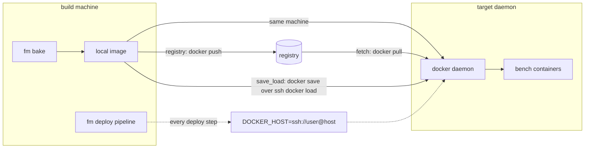

# Transports & Platforms

## Transports: getting the image to where it runs



Configured in `bench_config.toml`:

```toml
[registry]
distribution = "registry"    # push after bake; the target pulls during fetch
# distribution = "save_load" # airgap: docker save | ssh <target> docker load
# registry = "ghcr.io"       # only needed for docker login
# username = "ci-bot"        # ${VAR} env substitution supported
# password = "${REGISTRY_TOKEN}"

[deploy]
ssh_server = "prod.example.com"   # remote daemon; or pass --remote on fm deploy
ssh_user   = "frappe"
ssh_port   = 22
```

With a remote configured, `fm deploy` bakes on the local daemon, then drives every deploy step (fetch, pre-flight, migrate, swap, finalize) on the remote daemon over `DOCKER_HOST=ssh://`; the fm CLI is not used on the target. Only `fm deploy` reads `[deploy]`; `fm switch` and `fm prune` act on whatever daemon fm itself talks to. Registry mode encodes the registry host in the top-level `image` (e.g. `ghcr.io/acme/mybench`); `[registry] registry` exists only for `docker login`: when `registry`, `username` and `password` are all set fm logs in first (`username`/`password` are env-substituted, so `password = "${REGISTRY_TOKEN}"` works), otherwise ambient docker auth applies.

## Platforms (CPU architectures)

Images are architecture-specific. fm resolves the bake target as:

1. `[build].platform` if set (explicit always wins; a mismatch with the deploy target warns),
2. else, for `fm deploy` with a remote: the **remote daemon's architecture**, auto-detected (the image must match where it *runs*, not where it builds),
3. else the build daemon's native arch.

Cross-arch bakes (e.g. building `linux/amd64` on an Apple Silicon Mac) run the whole bake (provisioning containers and image builds) under `DOCKER_DEFAULT_PLATFORM`, which requires emulation (Rosetta/binfmt; Docker Desktop ships it) and only works with `[build].source = "provision"` (a `workspace` snapshot contains host-arch binaries, so fm refuses it). Before provisioning starts, fm checks the **base image** against the target architecture (a local copy of the right arch passes) and fails fast with the list of published architectures when the registry manifest provably lacks it. fm bakes single-platform images; it does not produce multi-arch manifest lists.

## Running fm in CI

There is no dedicated CI integration or ready-made pipeline recipe yet. But fm has no special host requirements: it runs anywhere Docker and your SSH keys exist, including a CI runner.

The typical shape: one `fm deploy <bench> --remote prod.example.com` on the runner (or plain `fm deploy <bench>` with the `[deploy]` remote above) bakes, pushes (registry mode) and drives the whole switch pipeline against the production daemon over `DOCKER_HOST=ssh://`.

For image-only jobs there is also a bench-less bake: `fm bake --apps frappe --apps erpnext:version-15 --image ghcr.io/acme/mybench --push` builds and pushes without any bench on the runner.

The remote path never runs the fm CLI on the target server: every step goes through the target's Docker daemon over `DOCKER_HOST=ssh://`. So the target needs only SSH access and a running Docker daemon (in registry mode the daemon must also be able to reach the registry); whether fm happens to be installed there does not matter.
