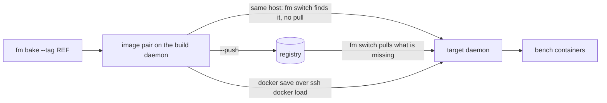

# Transports & Platforms

## Transports: getting the image to where it runs

A deploy is two commands, run on the host that owns the bench:

```bash
fm bake mybench --tag ghcr.io/acme/mybench:v42 --push
fm switch mybench ghcr.io/acme/mybench:v42
```

`--tag` takes a **full image ref**, so the tag you switch to is the tag you typed: nothing has to be read back out of the bake output. Omit `--tag` and the bake generates `<repo>:<timestamp>-<git sha>` from the bench's `image` repo and prints it, which you then pass to `fm switch`.

Whether anything has to be transported at all depends on where those two commands run.



**Same host, the single-server case.** `fm switch` begins by making sure both tags are on the daemon it talks to, and returns immediately when they already are. A bake on that same machine has just put them there, so the switch never pulls and you need no registry at all: skip `--push`, leave `[registry]` out entirely, and an `image = "local/mybench"` repo is enough.

**Bake here, run there.** Now the image has to cross the gap. There is no mode to select: `fm switch` asks the target daemon whether each tag is already there, and pulls only what is missing. So you choose by how you get the image across, not by a config value.

Via a registry, which is the normal path:

```toml
[build]
push = true                  # or pass --push on the command line

[registry]
# registry = "ghcr.io"       # only needed for docker login
# username = "ci-bot"        # ${VAR} env substitution supported
# password = "${REGISTRY_TOKEN}"
```

`fm bake --push` (or `[build] push = true`) publishes both tags, and `fm switch` on the target pulls whatever it does not already have, logging in first when `username` and `password` are set. The registry host is part of the image ref itself (`ghcr.io/acme/mybench`); `[registry] registry` exists only to name what `docker login` talks to. Omit the credentials to use whatever ambient auth the daemon already has.

Or by hand, for an airgapped target with no registry at all:

```bash
docker save ghcr.io/acme/mybench:v42 ghcr.io/acme/mybench-nginx:v42 | ssh prod docker load
ssh prod "fm switch mybench ghcr.io/acme/mybench:v42"
```

The presence check is what makes this work: the tags are already on the target daemon, so the switch uses them and never contacts a registry. If you skip the transport, the pull that follows is what fails, and it names the tag it could not get.

Either way you are moving a **pair** of tags. Every bake builds the app image and its paired `-nginx` assets image, which is the same tag with `-nginx` appended to the repo. Only the app tag is ever named on the command line; fm derives the second one, and both are what `fm switch` fetches, deploys and prunes together. That is why the `docker save` above names two tags.

## Platforms (CPU architectures)

Images are architecture-specific, and a bake has to target the architecture the image will *run* on, not necessarily the one it builds on. fm resolves the bake target as:

1. [`[build].platform`](../reference/configuration.md#deploy-tables) if set,
2. else the build daemon's native arch.

So when the machine you bake on and the machine you run on differ, an Apple Silicon laptop building for an amd64 server, set `[build].platform = "linux/amd64"` explicitly. Nothing detects the target for you.

Cross-arch bakes require emulation (Rosetta/binfmt; Docker Desktop ships it) and only work with `[build].source = "provision"` (a `workspace` snapshot contains host-arch binaries, so fm refuses it). The two image builds are `docker buildx build --platform <target> --load`; the provisioning containers that run before them take no platform argument, so they are steered by `DOCKER_DEFAULT_PLATFORM` for the duration of the bake. Before provisioning starts, fm checks the **base image** against the target architecture (a local copy of the right arch passes) and fails fast with the list of published architectures when the registry manifest provably lacks it.

`[build].platform` names exactly one platform. fm loads each built image into the local daemon, which is what lets the pre-flight boot check run it and a same-host `fm switch` skip the registry, and docker cannot load a multi-platform manifest list. A comma-separated value is refused rather than attempted. If you need a manifest list covering several architectures, push one yourself from a container-driver buildx builder.

## Running fm in CI

There is no dedicated CI integration or ready-made pipeline recipe yet. But fm has no special host requirements: it runs anywhere Docker and your SSH keys exist, including a CI runner.

The shape is the same two commands, split across the two machines. Bake and push on the runner, then run the switch on the server that owns the bench:

```bash
# on the runner: no bench needed, just the app list and a ref you chose
fm bake --apps frappe --apps erpnext:version-15 --tag ghcr.io/acme/mybench:$GIT_SHA --push

# on the server that owns the bench
ssh prod "fm switch mybench ghcr.io/acme/mybench:$GIT_SHA"
```

Because you picked the ref up front, the two halves need nothing from each other but that string: no output parsing, no handoff file.

The bench-less bake (`--apps` or `--config` with no bench name) builds and pushes without any bench, compose project or site on the runner, so the runner needs Docker and a registry login and nothing else. The switch half has to run where the bench lives: it rewrites that bench's `bench_config.toml` and `docker-compose.yml`, drains its workers, dumps its database into the bench's `backups/` directory and moves its traffic. All of that is local filesystem and local daemon work, which is why the target runs fm itself over plain SSH.
