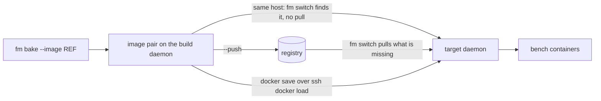

# Transports & Platforms

## Transports: getting the image to where it runs

A deploy is two commands, run on the host that owns the bench:

```bash
fm bake mybench --image ghcr.io/acme/mybench:v42 --push
fm switch mybench ghcr.io/acme/mybench:v42
```

`--image` names the app image the bake produces, and it takes either form. Give it a **full image ref** and it is built exactly as typed, so the tag you switch to is the tag you typed and nothing has to be read back out of the bake output. Give it a **bare repo** and the bake generates `<repo>:<timestamp>-<git sha>` and prints it, which you then pass to `fm switch`; omitting `--image` altogether falls back to the bench's own `image` repo the same way. What the image is built *from* is a separate input, `--base-image` (persisted as `[build].base_image`), and it is never the thing you switch onto.

Whether anything has to be transported at all depends on where those two commands run.



**Same host, the single-server case.** `fm switch` begins by making sure both tags are on the daemon it talks to, and returns immediately when they already are. A bake on that same machine has just put them there, so the switch never pulls and you need no registry at all: skip `--push`, leave `[registry]` out entirely, and an `image = "local/mybench"` repo is enough.

**Bake here, run there.** Now the image has to cross the gap. There is no mode to select: `fm switch` asks the target daemon whether each tag is already there, and pulls only what is missing. So you choose by how you get the image across, not by a config value.

Via a registry, which is the normal path:

```toml
[build]
push = true                  # or pass --push on the command line

[registry]
# registry = "ghcr.io"       # only needed for docker login
# username = "ci-bot"        # ${VAR} env substitution supported
# password = "${REGISTRY_TOKEN}"
```

`fm bake --push` (or `[build] push = true`) publishes both tags, and `fm switch` on the target pulls whatever it does not already have, logging in first when `username` and `password` are set. The registry host is part of the image ref itself (`ghcr.io/acme/mybench`); `[registry] registry` exists only to name what `docker login` talks to. Omit the credentials to use whatever ambient auth the daemon already has.

Or by hand, for an airgapped target with no registry at all:

```bash
docker save ghcr.io/acme/mybench:v42 ghcr.io/acme/mybench-nginx:v42 | ssh prod docker load
ssh prod "fm switch mybench ghcr.io/acme/mybench:v42"
```

The presence check is what makes this work: the tags are already on the target daemon, so the switch uses them and never contacts a registry. If you skip the transport, the pull that follows is what fails, and it names the tag it could not get.

Either way you are moving a **pair** of tags. Every bake builds the app image and its paired `-nginx` assets image, which is the same tag with `-nginx` appended to the repo. Only the app tag is ever named on the command line; fm derives the second one, and both are what `fm switch` fetches, deploys and prunes together. That is why the `docker save` above names two tags.

## Platforms (CPU architectures)

Images are architecture-specific, and a bake has to target the architecture the image will *run* on, not necessarily the one it builds on. fm resolves the bake target as:

1. [`[build].platform`](../reference/configuration.md#deploy-tables) if set,
2. else the build daemon's native arch.

So when the machine you bake on and the machine you run on differ, an Apple Silicon laptop building for an amd64 server, set `[build].platform = "linux/amd64"` explicitly. Nothing detects the target for you.

Cross-arch bakes require emulation (Rosetta/binfmt; Docker Desktop ships it) and only work with `[build].source = "provision"` (a `workspace` snapshot contains host-arch binaries, so fm refuses it). The two image builds are `docker buildx build --platform <target> --load`; the provisioning containers that run before them take no platform argument, so they are steered by `DOCKER_DEFAULT_PLATFORM` for the duration of the bake. Before provisioning starts, fm checks the **base image** the bake builds from (`fm bake --base-image REF`, or `[build].base_image`, defaulting to fm's published base) against the target architecture (a local copy of the right arch passes) and fails fast with the list of published architectures when the registry manifest provably lacks it.

`[build].platform` names exactly one platform. fm loads each built image into the local daemon, which is what lets the pre-flight boot check run it and a same-host `fm switch` skip the registry, and docker cannot load a multi-platform manifest list. A comma-separated value is refused rather than attempted. If you need a manifest list covering several architectures, push one yourself from a container-driver buildx builder.

## Running fm in CI

fm has no special host requirements: it runs anywhere Docker and your SSH keys exist, including a CI runner. For GitHub Actions there is an action in this repository that wraps the two commands below; the raw shape is worth reading first, because the action is only those commands with the arguments filled in.

The shape is the same two commands, split across the two machines. Bake and push on the runner, then run the switch on the server that owns the bench:

```bash
# on the runner: no bench needed, just the app list and a ref you chose
fm bake --apps frappe --apps erpnext:version-15 --image ghcr.io/acme/mybench:$GIT_SHA --push

# on the server that owns the bench
ssh prod "fm switch mybench ghcr.io/acme/mybench:$GIT_SHA"
```

Because you picked the ref up front, the two halves need nothing from each other but that string: no output parsing, no handoff file.

The bench-less bake (`--apps` or `--config` with no bench name) builds and pushes without any bench, compose project or site on the runner, so the runner needs Docker and a registry login and nothing else. The switch half has to run where the bench lives: it rewrites that bench's `bench_config.toml` and `docker-compose.yml`, drains its workers, dumps its database into the bench's `backups/` directory and moves its traffic. All of that is local filesystem and local daemon work, which is why the target runs fm itself over plain SSH.

### The GitHub Action

`rtCamp/Frappe-Manager` ships an `action.yml` that runs exactly those two halves. `phase` picks which: `bake`, `switch`, or `both`.

```yaml
- uses: rtCamp/Frappe-Manager@main
  with:
    phase: both
    image: ghcr.io/acme/mybench
    apps: |
      frappe
      erpnext:version-15
    push: true
    registry-username: ${{ github.actor }}
    registry-password: ${{ secrets.GITHUB_TOKEN }}
    bench: mybench
    ssh-host: prod.example.com
    ssh-user: deploy
    ssh-key: ${{ secrets.DEPLOY_KEY }}
```

`image` is the repository and `tag` is separate, defaulting to the short commit sha. The action composes them, so it always knows the exact ref and never reads it back out of fm's output. The ref it shipped is available afterwards as the `image` output.

It installs fm on the runner from a **git ref**, not PyPI, because the released version predates the current bake and switch surface. `fm-version` takes any branch, tag or sha, and the `FM_VERSION` environment variable overrides it without editing the workflow.

On the **switch target** it installs nothing. fm has to be there already, and the action finds it rather than assuming a PATH: `ssh host "fm ..."` runs a non-interactive shell, which reads neither `.bashrc` nor `.profile`, so an fm installed by `uv tool install` into `~/.local/bin` is invisible to a bare `fm`. The action looks on PATH, then at `~/.local/bin/fm`, `/usr/local/bin/fm` and `/usr/bin/fm`, then runs `--version` on what it found, because a half-finished install still leaves the shim behind. `fm-remote-path` names it explicitly when it lives somewhere else.

That check runs **before the bake**, deliberately. A bake is minutes of build plus a registry push, and finding out afterwards that the switch cannot start wastes all of it and leaves a pushed image nothing is going to deploy.

Overlays reach the bake two ways, and they compose in this order: `config-files` (paths in your checked-out repo, one per line, later files winning) then `config` (a single path, or the TOML itself inline). Paths are relative to the workspace, so the job needs `actions/checkout` first, and a missing file is reported rather than silently skipped.

```yaml
- uses: rtCamp/Frappe-Manager@main
  with:
    phase: bake
    image: ghcr.io/acme/mybench
    config-files: |
      ci/base.toml
      ci/prod.toml
    config: |
      [build]
      source = "provision"
```

#### Secrets in a committed config

Every overlay the action passes is run through `FM_ACTION_*` environment expansion first, so a config file can live in the repo while its secrets live in the environment:

```toml
# ci/prod.toml, committed
[registry]
username = "acme-ci"
password = "${FM_ACTION_REGISTRY_TOKEN}"
```

```yaml
- uses: rtCamp/Frappe-Manager@main
  env:
    FM_ACTION_REGISTRY_TOKEN: ${{ secrets.REGISTRY_TOKEN }}
  with:
    image: ghcr.io/acme/mybench
    config-files: ci/prod.toml
```

Three rules, each of them deliberate. Only names starting with `FM_ACTION_` are substituted, so a `$HOME` or `$PATH` inside a config value stays exactly as written. A referenced `FM_ACTION_*` variable that is not set is an **error**, not an empty string and not the literal text, because a typo that survives as a literal password fails much later and much more confusingly. And only the variable **names** are logged, never the values.

Shell default syntax like `${FM_ACTION_TOKEN:-fallback}` is refused rather than passed through, since silently forwarding it would look like it worked. The expanded result is written to a mode-600 file and fm is given the path, so the secret never appears in a command line where other processes could read it.

This is a CI-layer feature, not a config-file feature: fm itself does not expand these. Doing it at load time would write the plaintext straight back out, because `export_to_toml` builds from the model and normal operation rewrites `bench_config.toml` from dozens of call sites. The one exception predates it and is narrower: `[registry].username` and `password` are env-substituted by fm itself, at the moment of `docker login`, so nothing expanded is ever persisted.

Set `platform` when the runner and the server differ in architecture, since nothing detects the target for you. Set `ssh-known-hosts` to pin the host key; left empty the action falls back to `ssh-keyscan`, which trusts whatever answers on the first connection.
