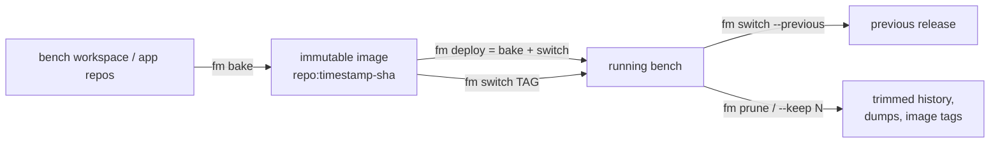
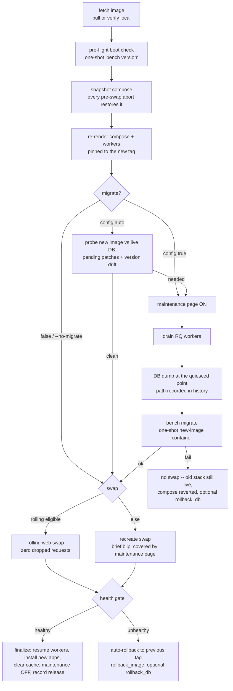
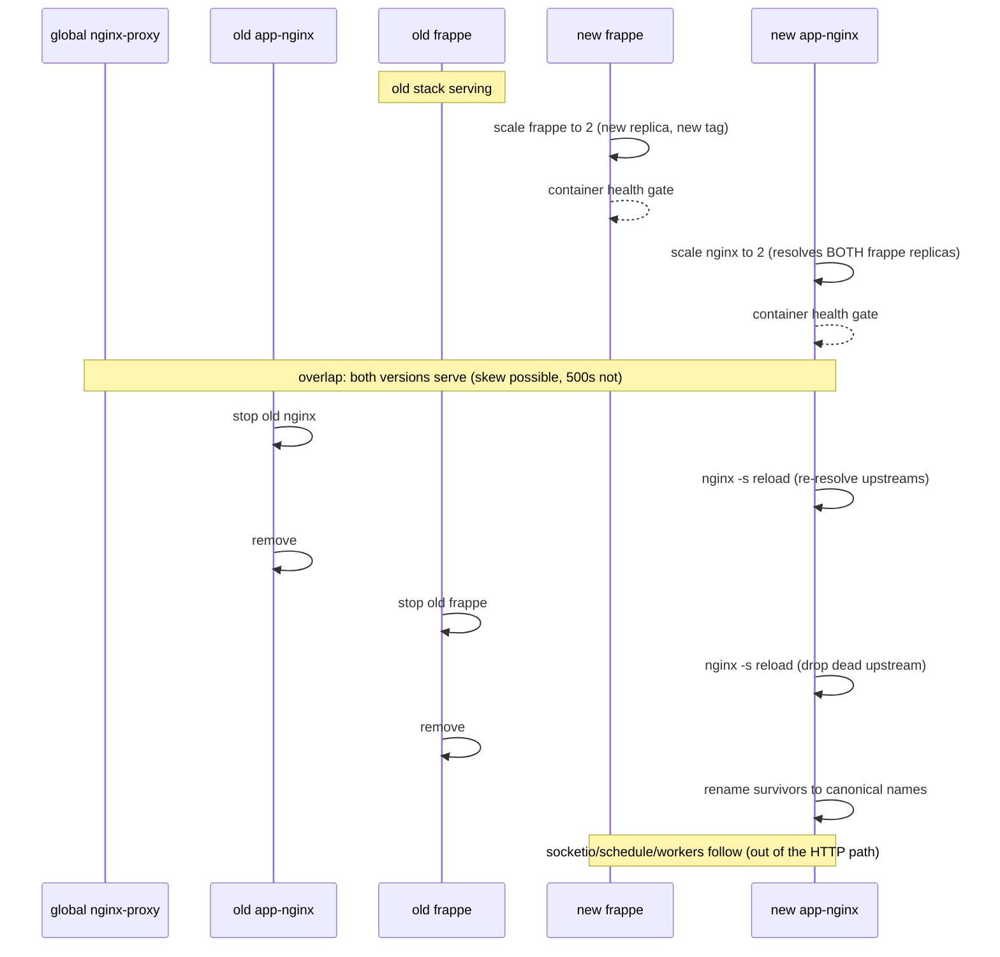

# Deployment — Image Benches

fm runs a bench in one of two **runtimes**:

| Runtime | What runs | For |
|---|---|---|
| `mount` | your editable workspace, bind-mounted into containers | development |
| `image` | an immutable, pre-built app image (code + venv + assets baked in) | production |

This guide covers the image lifecycle: **bake** an image, **deploy** it, **roll back**, keep the release history **pruned** — and how fm moves traffic without dropping requests.

## The lifecycle at a glance



- `fm bake <bench>` — build the image only (prints the tag).
- `fm deploy <bench>` — bake **and** run the full switch pipeline in one command.
- `fm switch <bench> <tag>` — deploy an already-built tag (no bake).
- `fm switch <bench> --previous` — roll back (same pipeline pointed backwards, migrate disabled).
- `fm prune <bench>` — remove old releases; also available inline as `--keep N` on deploy/switch.

Every deploy is recorded in the bench's `bench_config.toml` under `[deploy_state]` (current tag, previous tag, full history with migrate status and the DB dump taken). `fm info <bench>` shows the whole history in its **deploys** section.

## The switch pipeline

Forward deploys and rollbacks are the *same pipeline* pointed at different tags:



Key properties:

- **Aborts are safe.** Any failure before the swap restores the compose snapshot — the old stack never stopped serving, and a later plain `compose up` cannot jump tags.
- **A failed migrate never swaps.** `bench migrate` is transactional/resumable, so the default is keep-old and re-run after fixing.
- **The DB dump is exact.** It is taken while requests are already on the maintenance page and workers are drained, so restoring it loses nothing that happened before the migrate.
- **Drain and dump are not migrate-only.** Workers are drained on every deploy (`drain_workers = true`, the default), and with `backup_db = true` (the default) the DB dump is taken even for `--no-migrate` deploys; set `backup_db = "auto"` to dump only when a schema step (migrate or restore) runs.

## The rolling web swap

When the version overlap is safe, fm runs old and new web replicas side by side and drains the old — zero dropped requests instead of the recreate blip:



The stop → reload → remove order exists because app-nginx resolves its `upstream frappe` once at config load: killing a replica without a reload would leave a dead IP that black-holes connections.

**When is rolling eligible?** (`--rolling`/`--no-rolling` overrides the rules)

| Situation | Swap |
|---|---|
| no migrate and no DB restore | rolling |
| `maintenance_mode_phases = []` (operator asserts the migration is additive) | rolling |
| migrate/restore **under** the maintenance page (both replicas serve the 503) | rolling |
| migrate/restore with the maintenance page disabled | recreate |

Honest caveat: rolling is zero-**downtime**, not zero-**skew** — during the overlap a request may see old assets with new code or vice-versa. Eligibility guarantees both versions are DB-compatible, so the skew cannot 500.

The same engine powers `fm restart --rolling`: a zero-downtime web-tier recreate on the *current* tag (fresh containers, no release change).

## Rolling back

```bash
fm switch mybench --previous                 # code rollback; migrate disabled automatically
fm switch mybench --previous --restore-db    # code AND database back together
fm switch mybench local/mybench:<older-tag> --no-migrate   # further than one release
```

- `--previous` disables migrate for the run (old code must never migrate a newer schema); override with an explicit `--migrate`.
- `--restore-db` finds the DB dump recorded for the **current** (bad) deploy in the history and imports it before the swap — a restore is schema-grade, so it runs under the maintenance window like a migrate. Rows written after the bad deploy went live are discarded; that is why it is never implicit.
- After a rollback, `previous_tag` points at the tag you just left — running `fm switch --previous` again re-deploys it (deliberate: rollback of a rollback is a redo).

## Transports — getting the image to where it runs

```mermaid
flowchart LR
    subgraph build [build machine]
        B[fm bake] --> LI[local image]
    end
    subgraph target [target daemon]
        RD[docker daemon] --> RUN[bench containers]
    end
    LI -->|same machine| RD
    LI -->|registry: docker push| REG[(registry)] -->|fetch: docker pull| RD
    LI -->|save_load: docker save over ssh docker load| RD
    B -.->|every pipeline step| DH[DOCKER_HOST=ssh://user@host]
    DH -.-> RD
```

Configured in `bench_config.toml`:

```toml
[registry]
distribution = "registry"    # push after bake; the target pulls during fetch
# distribution = "save_load" # airgap: docker save | ssh <target> docker load

[deploy]
ssh_server = "prod.example.com"   # remote daemon; or pass --remote on fm deploy
ssh_user   = "frappe"
ssh_port   = 22
```

With a remote configured, the **entire pipeline** drives the remote daemon over `DOCKER_HOST=ssh://` — no fm needed on the target. Registry mode encodes the registry host in the top-level `image` (e.g. `ghcr.io/acme/mybench`); when `[registry] registry/username/password` are all set they are used for `docker login`, otherwise ambient docker auth applies.

## Platforms (CPU architectures)

Images are architecture-specific. fm resolves the bake target as:

1. `[build].platform` if set (explicit always wins; a mismatch with the deploy target warns),
2. else, for `fm deploy` with a remote: the **remote daemon's architecture**, auto-detected — the image must match where it *runs*, not where it builds,
3. else the build daemon's native arch.

Cross-arch bakes (e.g. building `linux/amd64` on an Apple Silicon Mac) run the whole bake — provisioning containers and image builds — under `DOCKER_DEFAULT_PLATFORM`, which requires emulation (Rosetta/binfmt; Docker Desktop ships it) and only works with `[build].source = "provision"` (a `workspace` snapshot contains host-arch binaries, so fm refuses it). Before provisioning starts, fm verifies the **base image** actually publishes the target architecture and fails fast with the available list if not. Multi-arch manifest lists are not supported — one platform per bake.

## Releases, history, and pruning

```bash
fm info mybench          # deploys section: every release, newest first, with migrate status
fm prune mybench --dry-run
fm prune mybench --keep 3
fm deploy mybench --keep 7   # prune inline after a successful deploy (opt-in)
```

Pruning splits two concerns:

- **History rows** are audit lines — the newest N are kept (`--keep`, default `[switch].keep_releases = 7`).
- **Artifacts are refcounted** — a DB dump dir is deleted only when no kept row references it; an image tag (and its paired `-nginx` assets image) is removed only when neither a kept row nor the protected set (current, previous, seed, base) references it.

Nothing a running or rollback-reachable release needs can be pruned.

## Configuration reference

### `[build]`

| Key | Default | Meaning |
|---|---|---|
| `source` | `"provision"` | `provision` = clone + install fresh (reproducible); `workspace` = snapshot the bench's on-disk workspace |
| `base_image` | fm's published base | the `FROM` / provisioning image |
| `python_version` / `node_version` | auto-detected | toolchain baked into the image |
| `platform` | native / auto-detected | target architecture (see Platforms) |
| `include` | `[]` | extra host paths baked in (`src` or `src:dest`) |

### `[switch]`

| Key | Default | Meaning |
|---|---|---|
| `migrate` | `true` | `true` / `false` / `"auto"` (probe the new image against the live DB) |
| `migrate_timeout` | `300` | seconds for the one-shot migrate |
| `migrate_command` | — | custom migrate command override |
| `maintenance_mode` | `true` | show the maintenance page during schema-changing steps |
| `maintenance_mode_phases` | `["migrate"]` | `[]` asserts a backward-compatible migration (enables rolling with migrate) |
| `backup_db` | `true` | `true` / `false` / `"auto"` (dump only when a schema step runs) |
| `rollback_image` | `true` | auto-rollback to the previous tag on a failed health gate |
| `rollback_db` | `false` | also restore the dump during that auto-rollback (requires `backup_db`) |
| `install_apps` | `true` | install newly-baked apps to the site during finalize |
| `keep_releases` | `7` | retention used by `fm prune` |
| `drain_workers` (+ `_timeout`, `_poll`, `skip_stale_*`) | `true` | drain RQ workers before migrate/swap |
| `common_site_config` / `site_config` | — | keys merged into the site configs during finalize |
| `hooks` | — | `before/after_migrate`, `before/after_restart` (container + `host.*` variants) |

### `[registry]` and `[deploy]`

| Key | Meaning |
|---|---|
| `registry.distribution` | `"registry"` (push/pull) or `"save_load"` (airgap over SSH) |
| `registry.registry` / `username` / `password` | registry host + `docker login` credentials (env-substituted); omit to use ambient auth |
| `deploy.ssh_server` / `ssh_user` / `ssh_port` | remote daemon target (`--remote` overrides) |
