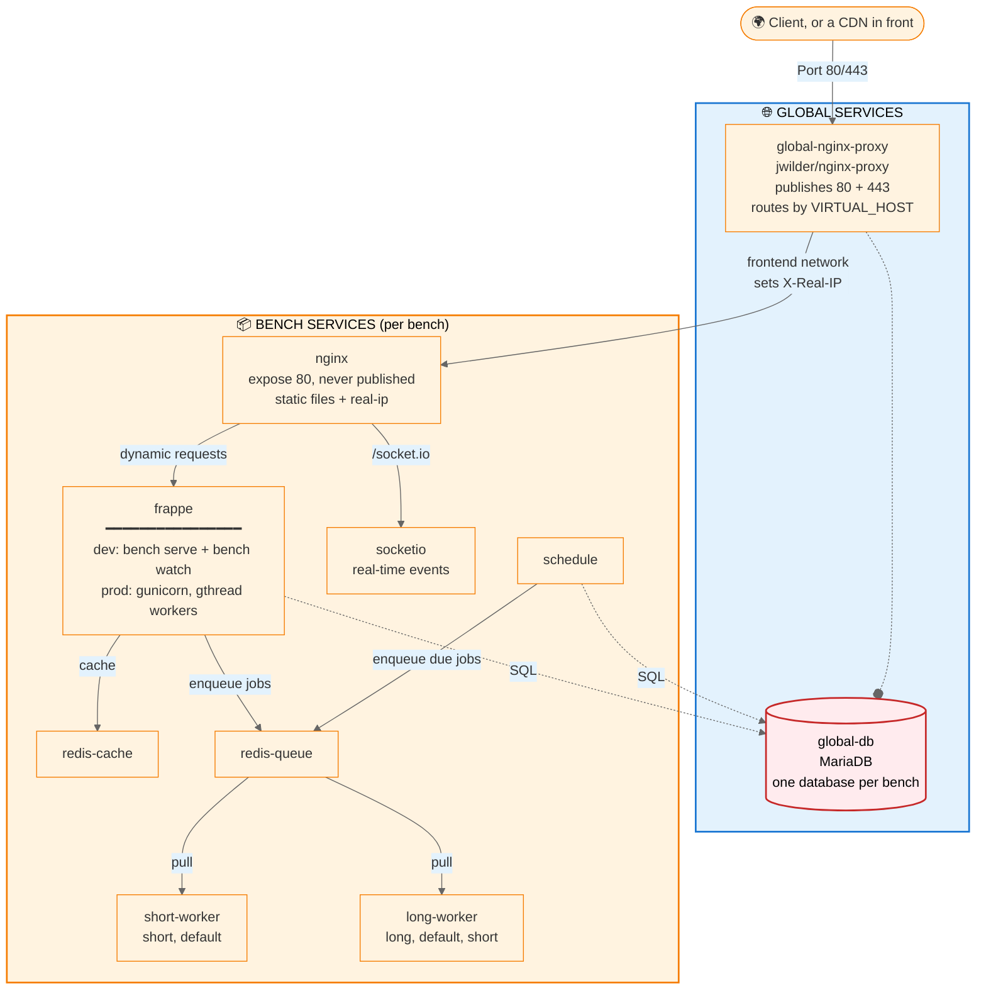

# Architecture

How fm's containers, networks and volumes fit together, and the path a request takes to reach your code.

## Overview

fm runs a **two-tier Docker layout**:

1. **Global services**, started once per machine: a shared MariaDB (`global-db`) and a `jwilder/nginx-proxy` (`global-nginx-proxy`) that owns ports 80 and 443.
2. **Per-bench services**, one stack per bench: the frappe web container, its own nginx, socketio, the scheduler, two Redis instances, the RQ worker containers and (optionally) admin tools.

Many benches share one host, one database server and one proxy.

Orthogonally, each bench runs in one of **two runtimes** ([`runtime`](configuration.md#runtime) in `bench_config.toml`):

- **`mount`** (default): app code lives on the host in `workspace/frappe-bench/` and is live-mounted into the containers. Editable; built for development.
- **`image`**: app code is baked into an immutable image (`fm bake`) and deploys happen by switching image tags (`fm switch`). Only mutable data is bound in from the workspace: the site directory, `common_site_config.json`, `apps.txt`, `logs` and `config`.

The topology below is identical in both runtimes; only where the app code comes from differs. See the [Deployment guide](../deploy/index.md).

!!! tip "Quick navigation"
    Jump to: [The request path](#request-path) · [Workspace layout](#workspace-layout) · [Global services](#global-services) · [Per-bench services](#per-bench-services) · [Networks](#networks) · [Volumes](#volumes)

### Service architecture diagram



Only the `frappe` container differs between environments:

- **dev:** `bench serve` (Werkzeug, one process with a thread per request, no worker pool) plus `bench watch` for asset hot-reload.
- **prod:** gunicorn with `gthread` workers, sized automatically. See [Web Serving & Concurrency](../concepts/web-serving.md#gunicorn-workers-and-threads).

---

## The request path {#request-path}

Every request crosses the same hops, and each one changes something that the next hop depends on.

```
client (or CDN edge)
  → global-nginx-proxy        published :80/:443, TLS terminates here
  → bench nginx               on fm-global-frontend-network, :80 exposed only
  → gunicorn / bench serve    or socketio for /socket.io
```

1. **The global proxy** is the only fm container that publishes host ports. It reads the `Host:` header and picks the bench whose nginx carries a matching `VIRTUAL_HOST` (fm sets it to the bench's primary domain plus every `alias_domains` entry). It terminates TLS using the certs under `services/nginx-proxy/certs/`.
2. **The bench's nginx** serves `/assets` and public site files as static files, proxies `/socket.io` to the `socketio` container, and sends everything else to the web process as `@webserver`. Admin tools, when enabled, are proxied from `/mailpit/` and `/adminer/` here too.
3. **The web process** is gunicorn in prod and `bench serve` in dev, both on port 80 inside the container.

!!! warning "The `/assets` fallthrough is a dev-only safety net"
    `/assets` is `try_files $uri @webserver`, so a bundle nginx cannot find is retried against the web process. That recovers the file only in `dev`: frappe wraps its app in `application_with_statics()` inside `serve()`, whereas prod runs `gunicorn frappe.app:application`, the bare module-level app with no static middleware. In prod the miss is a hard 404, and where nginx was looking depends on the runtime:

    - **`mount`:** the stock `-nginx` image plus the single `./workspace:/workspace` bind, so nginx reads `/workspace/frappe-bench/sites/assets` live off the host. A missing bundle means the bench has not built it; rebuild it in the bench.
    - **`image`:** the baked `<repo>-nginx:<tag>` image (`Docker/nginx/Dockerfile`, the `app-assets` stage), and the image-mode binds deliberately cover only `sites/<site>`, `common_site_config.json`, `apps.txt`, `logs` and `config`, never `sites/assets`, so nothing masks the baked bundles. A missing bundle needs a rebake.

### The frontend network is the only way in {#frontend-network}

Bench nginx declares `expose: 80`, never `ports:`. Nothing about a bench is reachable from the host or the LAN; the only route in is the shared `fm-global-frontend-network` that the global proxy also sits on.

That network's subnet is a `/16` in `10.0.0.0/8`. fm prefers `10.1.0.0/16` and, on first `fm services` setup, falls back to the first free `10.x.0.0/16` if that one collides with an existing Docker network. The chosen value and the proxy's static address on it are persisted as [`network.subnet_cidr` and `network.proxy_ip`](configuration.md#network) in `fm_config.toml` and written into the services compose file. The backend network keeps a fixed `10.2.0.0/16`.

!!! note "Containers resolve their own domain to the proxy"
    `frappe`, `socketio` and `schedule` get `extra_hosts` entries mapping the bench's domains to the proxy's frontend-network IP. An outbound HTTP call from inside the bench to its own site therefore travels the full chain rather than short-circuiting, so it sees the same nginx rules and the same TLS as an external visitor.

### Restoring the visitor's IP {#real-ip}

Because every request reaches bench nginx from the proxy's own frontend-network address, `$remote_addr` there would otherwise be the proxy for the entire internet, and frappe's `request_ip`, its per-IP rate limiting and the Activity Log would see one address for every visitor.

fm fixes this in two halves:

- **Bench nginx** gets an fm-generated `configs/nginx/conf/custom/real-ip.conf` containing `set_real_ip_from <frontend subnet>;` and `real_ip_header X-Real-IP;`. The frontend network being the only route in is what makes trusting that whole subnet safe. The file is regenerated whenever the compose file is regenerated and on every `fm start`, so a bench never boots without it once the subnet is known.
- **The global proxy** needs the same treatment only when something else sits in front of it. `fm self real-ip --cdn cloudflare` (or `--trust <CIDR>`, repeatable) writes the trusted ranges and the header to read into the proxy's `conf.d`. Without it, a CDN's edge address is what the proxy calls the client, and that is what it forwards on.

```bash
# Trust Cloudflare's published ranges, reading the client from CF-Connecting-IP
fm self real-ip --cdn cloudflare

# Trust your own load balancer instead (X-Forwarded-For by default)
fm self real-ip --trust 203.0.113.0/24

# Show what is trusted right now
fm self real-ip --status
```

!!! warning "Trust only what you actually sit behind"
    Whatever the proxy trusts fully controls the client IP that fm, your logs and frappe go on to see. Each run replaces the whole configuration, so pass every range in one call.

### Why a TLS-terminating CDN does not loop {#https-method}

fm pins `HTTPS_METHOD=noredirect` on every bench nginx container. `jwilder/nginx-proxy` would otherwise 301 plain HTTP to HTTPS; behind a CDN that terminates TLS and forwards HTTP to the origin, that redirect is what produces a redirect loop. With `noredirect` the proxy serves both schemes and leaves the redirect decision to the edge.

Per-domain HTTP-to-HTTPS redirects that fm *does* want live in `services/nginx-proxy/vhostd/<domain>`, written by `fm ssl add`.

---

## Workspace layout {#workspace-layout}

fm keeps everything under a single root directory (default `~/frappe/`).

!!! info "Relocate with an environment variable"
    Set `FRAPPE_MANAGER_HOME` before any fm command to use a custom location:
    ```bash
    export FRAPPE_MANAGER_HOME=/srv/frappe
    ```

<div class="annotate" markdown>

```tree title="~/frappe/ (Frappe Manager root)"
~/frappe/
│
├── 📄 fm_config.toml                    # (1)
│
├── 📁 logs/
│   └── fm.log                           # (2)
│
├── 📁 backups/
│   └── migrations/
│       └── 12-Apr-26--14-30-45/         # (3)
│
├── 📁 archived/                         # (4)
│
├── 📁 services/                         # (5)
│   ├── docker-compose.yml
│   ├── secrets/                         # (6)
│   ├── mariadb/
│   │   ├── conf/
│   │   └── data/                        # (7)
│   └── nginx-proxy/
│       ├── ssl/
│       │   ├── acmesh/
│       │   │   ├── .acme.sh/            # (8)
│       │   │   └── example.com/
│       │   │       ├── fullchain.pem
│       │   │       └── key.pem
│       │   └── custom/
│       │       └── byo.example.com/     # key.pem, fullchain.pem, ca.pem
│       ├── certs/                       # (9)
│       │   ├── example.com.crt → /usr/share/nginx/ssl/acmesh/example.com/fullchain.pem
│       │   └── example.com.key → /usr/share/nginx/ssl/acmesh/example.com/key.pem
│       ├── vhostd/                      # (10)
│       │   └── example.com
│       └── confd/                       # (11)
│
└── 📁 sites/                            # (12)
    ├── mybench.localhost/
    │   ├── 📄 bench_config.toml         # (13)
    │   ├── docker-compose.yml           # (14)
    │   ├── docker-compose.workers.yml
    │   ├── docker-compose.admin-tools.yml
    │   ├── backups/
    │   │   └── migrations/              # (15)
    │   ├── configs/                     # (16)
    │   │   ├── adminer/
    │   │   └── nginx/
    │   │       ├── conf/
    │   │       │   ├── conf.d/default.conf     # (17)
    │   │       │   ├── custom/real-ip.conf     # (18)
    │   │       │   └── http_auth/              # (19)
    │   │       └── logs/                # (20)
    │   └── workspace/
    │       └── frappe-bench/            # (21)
    │           ├── apps/                # (22)
    │           │   ├── frappe/
    │           │   ├── erpnext/
    │           │   └── custom_app/
    │           ├── sites/               # (23)
    │           │   ├── apps.txt
    │           │   ├── common_site_config.json
    │           │   ├── currentsite.txt
    │           │   └── mybench.localhost/
    │           │       └── site_config.json
    │           ├── logs/                # (24)
    │           │   ├── web.log
    │           │   ├── web.error.log
    │           │   ├── web.dev.log
    │           │   ├── worker.log
    │           │   └── schedule.log
    │           ├── config/              # (25)
    │           └── env/                 # (26)
    │
    └── prod.example.com/
        └── ... (same structure)
```

</div>

1. **Global configuration**: machine-wide fm settings (ngrok token, DNS credentials, log level, frontend network addressing).
2. **CLI operation log**: everything every `fm` command did. Rotates at 10 MiB, keeping `fm.log.1.gz` to `fm.log.3.gz`.
3. **Infrastructure migration backups**: one directory per migration session, named `%d-%b-%y--%H-%M-%S`, with a per-bench subdirectory inside.
4. **Archived benches**: benches moved aside by `fm migrate --on-failure=archive`.
5. **Global services**: the `global-db` and `global-nginx-proxy` stack.
6. **Database secrets**: `db_password.txt` and `db_root_password.txt`, mounted into `global-db` as Docker secrets.
7. **MariaDB data**: Linux only. macOS uses the named volume `fm-global-db-data` to avoid bind-mount slowness.
8. **acme.sh installation**: the certificate automation tool and its state.
9. **Certificate symlinks**: what `global-nginx-proxy` actually reads. Each link's target is a container path (the proxy mounts `ssl/` at `/usr/share/nginx/ssl`), pointing at the real files in `ssl/acmesh/<domain>/`, `ssl/dev/<domain>/` or `ssl/custom/<domain>/`.
10. **Per-domain vhost snippets**: the HTTP-to-HTTPS redirects written by `fm ssl add`.
11. **Global nginx `conf.d`**: fm's own snippets (the `fm self real-ip` config, `fm_headers.conf`) plus custom server blocks for non-fm Docker projects.
12. **All benches**: one subdirectory per bench.
13. **Bench configuration**: environment, runtime, SSL, upload limit, restart policy, auth, worker care.
14. **Compose files**: the layered core, workers and admin-tools stacks.
15. **Bench migration backups**: `bench_config.toml`, compose files and a gzipped DB dump per migration session.
16. **fm-managed container config**: bind-mounted into the bench's nginx and adminer containers.
17. **Bench nginx server block**: rendered from the site map; do not hand-edit, `fm` regenerates it.
18. **Real client IP restoration**: generated by fm, refreshed on every `fm start`.
19. **Basic auth**: the htpasswd file backing `fm auth`.
20. **Bench nginx logs**: the structured JSON access log and the error log.
21. **Frappe workspace**: the standard bench directory layout.
22. **Installed apps**: frappe, erpnext and your own. Live-mounted in `mount` runtime, baked into the image in `image` runtime.
23. **Site files**: frappe site configuration and data.
24. **Application logs**: web, worker and scheduler output. See [Logs & Debugging](logs.md).
25. **Process config**: the split `*.fm.supervisor.conf` files fm generates, plus the `fm-web-server.sh` gunicorn wrapper.
26. **Python virtualenv**: this bench's packages.

!!! warning "Do not edit workspace files directly"
    Files under `workspace/frappe-bench/` belong to frappe and bench. Use `fm shell` and `bench` commands instead.

---

## Global services

Started once by fm and shared by every bench on the host.

### `global-db` {#global-db}

`mariadb:11.8`, reachable on 3306 over the backend network only: it publishes no host port.

Each bench gets its own database in this one server, named `fm_<benchname>_<16 hex chars>`, with a dedicated user scoped to it. Passwords are generated on setup and mounted as Docker secrets from `services/secrets/`.

Storage is a bind mount at `services/mariadb/data/` on Linux and the named volume `fm-global-db-data` on macOS. The server runs with `utf8mb4` defaults and `--skip-character-set-client-handshake`, and `MARIADB_AUTO_UPGRADE` runs `mariadb-upgrade` when the engine version changes.

```bash
# Shell into the database server
fm services shell global-db

# Open a bench's own database
fm shell mybench -c "bench mariadb"
```

A bench can be pointed at an external server instead; see the [external database guide](../guides/external-database.md).

### `global-nginx-proxy` {#global-nginx-proxy}

`jwilder/nginx-proxy:1.11`, publishing 80 and 443. It watches the Docker socket, discovers each bench nginx by its `VIRTUAL_HOST` environment variable and routes by `Host:` header. It enables HTTPS for a domain as soon as `<domain>.crt` and `<domain>.key` appear in `services/nginx-proxy/certs/`.

Access logs use the same JSON format as bench nginx, so both hops feed one ingestion pipeline.

**See also:** [SSL guide](../guides/ssl.md), [Domains guide](../guides/domains.md), [`fm ssl`](../commands/ssl.md).

---

## Per-bench services

Container names are prefixed `fm__<benchname>__`, with dots in the bench name replaced by underscores.

**Core stack** (`docker-compose.yml`): `frappe`, `nginx`, `socketio`, `schedule`, `redis-cache`, `redis-queue`. The frappe and nginx images are fm's own; Redis is `redis:8-alpine`.

**Workers** (`docker-compose.workers.yml`): one container per RQ queue, generated from the supervisor configs in the bench's `config/` directory rather than hard-coded. `short-worker` consumes `short,default` and `long-worker` consumes `long,default,short`, so a `default` job is picked up by whichever is free. Extra queues come from the `workers` key of `common_site_config.json`, each getting its own container. Each container runs `background_workers` RQ processes (default 1, also from `common_site_config.json`); see [Workers & Background Jobs](../concepts/background-jobs.md).

**Admin tools** (`docker-compose.admin-tools.yml`, only when [`admin_tools`](configuration.md#admin-tools) is true, which is the default in `dev`): mailpit at `/mailpit/` catching all outgoing mail, adminer at `/adminer/` for the database. Toggle with `fm update <bench> --admin-tools enable|disable`; see the [Admin Tools guide](../guides/admin-tools.md).

All of a bench's services start and stop together with `fm start` and `fm stop`. Auto-recovery after a daemon or host restart is governed by [`restart_policy`](configuration.md#restart-policy).

Inspect the effective stack, images and all, with:

```bash
fm self compose mybench config
fm self compose mybench ps
```

---

## Docker networks {#networks}

| Network | Scope | Carries |
|---------|-------|---------|
| `fm-global-frontend-network` | shared, external to the bench compose | `nginx`, `frappe`, `socketio`, `schedule` and the workers of **every** bench, plus `global-nginx-proxy`. The only route into a bench. |
| `fm-global-backend-network` | shared, external to the bench compose | `frappe`, `schedule`, the workers and `adminer` of every bench, plus `global-db`. |
| `fm__<bench>__site-network` | one per bench | Every container of that bench, including Redis and mailpit, which are on nothing else. |

!!! warning "The shared networks are shared, not isolated"
    Both global networks span every bench on the host, so containers from different benches can reach each other on them. Only the per-bench `site-network` is private, which is why bench nginx upstreams resolve the network-scoped aliases `frappe-site` and `socketio-site`: the bare name `frappe` also resolves on the shared frontend network, where Docker DNS would round-robin across every bench's frappe container.

---

## Docker volumes {#volumes}

- `fm-global-db-data`: MariaDB data on macOS. Linux bind-mounts `services/mariadb/data/` instead.
- `fm__<bench>__fm-sockets`: the supervisorctl unix socket, shared by every process container in the bench. This is what lets [`fmx`](../guides/fmx.md) drive supervisor from any of them.
- `fm__<bench>__redis-cache-data`, `fm__<bench>__redis-queue-data`: Redis persistence.
- `fm__<bench>__mailpit-data`: the mailpit message database.

How the workspace reaches the containers is the other thing the runtime decides. A `mount` bench binds the whole directory as `./workspace:/workspace` into `frappe`, `nginx`, `socketio`, `schedule` and every worker: one filesystem, so a code change is visible to all of them at once, and in `dev` `bench watch` rebuilds assets without a restart. An `image` bench carries the code in its image instead, binding in only the site directory, `common_site_config.json`, `apps.txt`, `logs` and `config`, so nothing on the host can mask what was baked. Either way it is a bind mount, not a Docker volume.

---

## Compose file structure {#compose-files}

A bench is three compose files layered together: `docker-compose.yml` always, `docker-compose.workers.yml` whenever the bench has workers, and `docker-compose.admin-tools.yml` when admin tools are enabled. The workers and admin-tools files declare the site network and the `fm-sockets` volume as `external`, so the core file owns them.

`fm` wires all of the present files up for you, and exposes that wiring:

```bash
fm self compose mybench ps
fm self compose mybench logs -f frappe
```

---

## Image tags {#image-tags}

fm's stack images are tagged with the fm version that pulled them: `ghcr.io/rtcamp/frappe-manager-<service>:v<fm-version>`, for example `ghcr.io/rtcamp/frappe-manager-frappe:v0.19.0` and `ghcr.io/rtcamp/frappe-manager-nginx:v0.19.0`. A `.dev` version yields a `.dev` tag.

An `image`-runtime bench replaces both fm stack images with its own bake. `fm bake` builds a pair: the app image, used for `frappe`, socketio, schedule and the workers, and a derived `<repo>-nginx:<tag>` from the `app-assets` stage, carrying the built frontend bundles for `nginx`. Only the app tag is ever named on the command line; the nginx tag is derived from it, and the two are deployed and pruned together. The repository comes from [`image`](configuration.md#images) in `bench_config.toml` and the tag from [`[deploy_state]`](configuration.md#deploy-state). `fm info <bench>` shows the pinned tag and the deploy history.

`fm self update-images` pulls the current set.

---

## Logging architecture {#logging}

| Log | Location | Rotation |
|-----|----------|----------|
| fm CLI | `~/frappe/logs/fm.log` | 10 MiB per file, 3 gzipped backups |
| Frappe app | `sites/<bench>/workspace/frappe-bench/logs/` | none; rotate it yourself |
| Bench nginx | `sites/<bench>/configs/nginx/logs/` | none; rotate it yourself |
| Global proxy | `services/nginx-proxy/logs/` | none; rotate it yourself |
| Container stdout/stderr | the Docker log driver | Docker's |

Bench nginx and the global proxy write the same JSON access-log format, including `request_id`, `client`, `xff` and upstream timings, so a single request can be followed across both hops.

```bash
fm logs mybench                      # the bench web server log, from disk
fm logs mybench --service nginx -f   # a container's log, from docker
```

See [Logs & Debugging](logs.md).

---

## Processes inside the containers {#process-architecture}

Every fm container runs supervisord, driven by the split `*.fm.supervisor.conf` files fm writes into `workspace/frappe-bench/config/`. `SERVICE_NAME` (or `WORKER_NAME`) picks which one a container waits for and runs, which is how one image serves the web, socketio, scheduler and worker roles.

**`frappe`, dev:**

```
supervisord
├── bench serve --port 80        (Werkzeug, threaded; no worker pool)
└── bench watch                 (asset rebuild watcher)
```

**`frappe`, prod:**

```
supervisord
└── fm-web-server.sh
    └── gunicorn -b 0.0.0.0:80 -w <N> --worker-class=gthread --threads <T> \
        --max-requests 1000 --max-requests-jitter 100 -t <http_timeout> \
        --graceful-timeout 30 frappe.app:application --preload
```

`<N>` defaults to `min(cpu_count, RAM_MB / 256)` and `<T>` to `max(2, min(cpu_count, 4))`; both, plus `max_requests`, are overridable in `common_site_config.json`. See [Web Serving & Concurrency](../concepts/web-serving.md#gunicorn-workers-and-threads). When New Relic is enabled the wrapper runs gunicorn under `newrelic-admin` with a `post_fork` hook, because `--preload` forks after the agent loads.

**Worker containers:** `bench worker --queue <queues>`, at `numprocs = background_workers`.

**`schedule`:** `bench schedule`.

**`socketio`:** `node apps/frappe/socketio.js`.

---

## See also

- [Configuration Files](configuration.md): every key in `fm_config.toml` and `bench_config.toml`
- [Web Serving & Concurrency](../concepts/web-serving.md): how requests are served and sized
- [Workers & Background Jobs](../concepts/background-jobs.md): queues and worker configuration
- [Environments](../guides/environments.md): what changes between `dev` and `prod`
