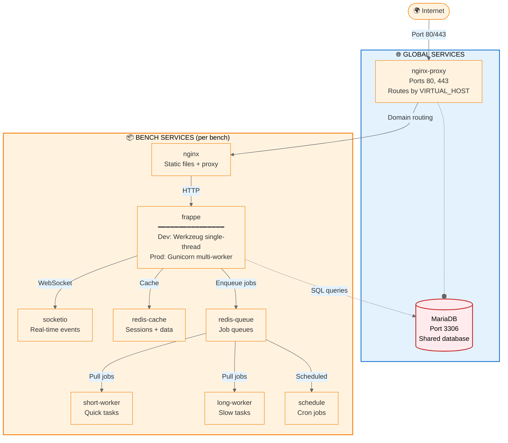

# Architecture

Frappe Manager's service architecture: how containers, networks, volumes, and directories work together.

## Overview

FM uses a **two-tier Docker architecture**:

1. **Global services**: Shared infrastructure (MariaDB database, nginx reverse proxy)
2. **Per-bench services**: Isolated environments (Frappe app, workers, Redis, nginx)

This design allows multiple benches to coexist on one machine while sharing database and proxy resources.

Independently of this two-tier layout, each bench runs in one of **two runtimes** (`runtime` in `bench_config.toml`):

- **`mount`** (default): app code lives on the host in `workspace/frappe-bench/` and is live-mounted into the containers. Editable; built for development.
- **`image`**: app code is baked into an immutable image (`fm bake`) and deploys happen by switching image tags (`fm deploy` / `fm switch`). The workspace holds only sites/config.

The container topology below is identical in both runtimes; only where the app code comes from differs. See the [Deployment guide](../deploy/index.md).

!!! tip "Quick navigation"
    Jump to: [Global Services](#global-services) · [Per-Bench Services](#per-bench-services) · [Networks](#networks) · [Volumes](#volumes) · [File Layout](#workspace-layout)

### Service Architecture Diagram



**Key concepts:**

- **Global services** (blue) are shared across all benches: one MariaDB instance, one nginx-proxy
- **nginx-proxy** routes requests by domain using `VIRTUAL_HOST` environment variable
- **Bench services** (orange) are created per bench: each bench has its own isolated set of containers
- **Dev vs Prod difference:** Only the frappe container differs:
    - **Dev:** Werkzeug single-threaded server + `bench watch` hot-reload
    - **Prod:** Gunicorn multi-worker server (workers = min(CPU cores, RAM/256MB), threaded) + auto-restart
- All benches share the same **MariaDB** database (red) but use separate databases within it

**Traffic flow:**

1. **Internet** sends HTTP/HTTPS request to server
2. **global-nginx-proxy** receives request, reads `Host:` header
3. **Routes to bench nginx** via `VIRTUAL_HOST` environment variable match
4. **Bench nginx** serves static files, proxies dynamic requests to frappe
5. **Frappe** processes request, queries MariaDB, uses Redis, enqueues background jobs
6. **Workers** pull jobs from Redis queues and execute them

---

## Workspace Layout

FM stores all data under a single root directory (default: `~/frappe/`).

!!! info "Relocate with environment variable"
    Set `FRAPPE_MANAGER_HOME` before any FM command to use a custom location:
    ```bash
    export FRAPPE_MANAGER_HOME=/srv/frappe
    ```

### Directory Tree

<div class="annotate" markdown>

```tree title="~/frappe/ (Frappe Manager Root)"
~/frappe/
│
├── 📄 fm_config.toml                    # (1)
│
├── 📁 logs/
│   └── fm.log                           # (2)
│
├── 📁 backups/
│   └── migrations/
│       └── 12-Apr-26--14-30-45/             # (3)
│           └── fm_config.toml
│
├── 📁 archived/                             # (5)
│
├── 📁 services/                         # (6)
│   ├── docker-compose.yml
│   ├── mariadb/
│   │   └── data/                            # (7)
│   └── nginx-proxy/
│       ├── ssl/
│       │   └── acmesh/
│       │       ├── .acme.sh/            # (8)
│       │       └── certs/
│       │           └── example.com/
│       │               ├── fullchain.pem
│       │               └── example.com.key
│       ├── certs/                       # (9)
│       │   ├── example.com.crt → ../ssl/acmesh/certs/example.com/fullchain.pem
│       │   └── example.com.key → ../ssl/acmesh/certs/example.com/example.com.key
│       ├── vhostd/                      # (10)
│       │   └── example.com
│       └── conf.d/                      # (11)
│           └── standalone-project
│
└── 📁 sites/                            # (12)
    ├── mybench.localhost/
    │   ├── 📄 bench_config.toml         # (13)
    │   ├── docker-compose.yml               # (14)
    │   ├── docker-compose.workers.yml
    │   ├── docker-compose.admin-tools.yml
    │   ├── backups/
    │   │   └── migrations/                  # (4)
    │   ├── logs/
    │   └── workspace/
    │       └── frappe-bench/            # (15)
    │           ├── apps/                # (16)
    │           │   ├── frappe/
    │           │   ├── erpnext/
    │           │   └── custom_app/
    │           ├── sites/               # (17)
    │           │   ├── apps.txt
    │           │   ├── common_site_config.json
    │           │   ├── currentsite.txt
    │           │   └── mybench.localhost/
    │           │       └── site_config.json
    │           ├── logs/                # (18)
    │           │   ├── web.log
    │           │   ├── web.error.log
    │           │   ├── web.dev.log
    │           │   ├── worker.log
    │           │   └── schedule.log
    │           ├── config/
    │           │   └── supervisor.conf
    │           └── env/                 # (19)
    │
    └── prod.example.com/
        └── ... (same structure)
```

</div>

1. **Global configuration**: Machine-wide FM settings (ngrok tokens, DNS credentials, logging level)
2. **CLI operation log**: All FM command output, auto-rotated at 10MB
3. **Infrastructure migration backups**: Global config backups; each migration session gets a unique timestamp
4. **Bench migration backups**: `bench_config.toml`, compose files, and gzipped DB dump per migration session
5. **Archived benches**: Benches moved aside on migration failure (`--on-failure=archive`)
6. **Global services**: Shared MariaDB and nginx-proxy containers
7. **MariaDB data**: Linux only (macOS uses Docker volume `fm-global-db-data`)
8. **acme.sh installation**: SSL certificate automation tool
9. **Certificate symlinks**: nginx-proxy reads from here (points to real certs in `ssl/acmesh/certs/`)
10. **HTTPS redirect configs**: Per-domain nginx redirects (HTTP → HTTPS)
11. **Standalone nginx blocks**: Custom configs for non-FM Docker projects
12. **All benches**: Each subdirectory is a bench
13. **Bench configuration**: Environment, SSL, upload limits, restart policy
14. **Docker Compose files**: Multi-file compose setup (core + workers + admin tools)
15. **Frappe workspace**: Standard Frappe bench directory layout
16. **Installed apps**: Frappe app source code (frappe, erpnext, custom apps)
17. **Site files**: Frappe site configuration and data
18. **Application logs**: Frappe/ERPNext runtime logs (split by environment)
19. **Python virtualenv**: Isolated Python packages for this bench

!!! warning "Do not directly edit workspace files"
    Files under `workspace/frappe-bench/` are managed by Frappe/ERPNext. Use `bench` commands inside the container instead of editing directly.

---

## Global Services

Shared infrastructure started once by FM, remain running across all benches.

### `global-db` {#global-db}

**Image:** `mariadb:10.6`  
**Ports:** `3306` (Docker networks only, **not exposed to host**)  
**Purpose:** Shared MariaDB database server for all benches

Each bench gets its own database in this shared instance. Database name format: `fm_<benchname>_<random>`.

!!! info "Platform-specific storage"
    **Linux:** Bind-mounted from `~/frappe/services/mariadb/data/` (direct filesystem access)  
    **macOS:** Named Docker volume `fm-global-db-data` (avoids macOS bind-mount slowness)

**Credentials:**

- Root and per-bench passwords: auto-generated, stored as files in `~/frappe/services/secrets/` (mounted as Docker secrets)
- Per-bench users: Auto-created with database-specific privileges

**Management:**

```bash
# Shell into the database service
fm services shell global-db

# Access a specific bench database
fm shell mybench -c "bench mariadb"
```

---

### `global-nginx-proxy` {#global-nginx-proxy}

**Image:** `jwilder/nginx-proxy:1.11`  
**Ports:** `80` (HTTP), `443` (HTTPS); **exposed to host**  
**Purpose:** Reverse proxy routing traffic to benches based on hostname

Routes incoming HTTP/HTTPS requests to bench containers using virtual host headers (`VIRTUAL_HOST` env var).

!!! tip "How routing works"
    Request arrives at `mybench.localhost` → nginx-proxy reads `Host:` header → Routes to container with `VIRTUAL_HOST=mybench.localhost`

**SSL Certificate handling:**

- Reads certs from `~/frappe/services/nginx-proxy/certs/`
- Expects: `<domain>.crt` and `<domain>.key` (symlinks to acme.sh storage)
- Auto-enables HTTPS when cert files present

**Configuration directories:**

- `vhostd/`: Per-domain HTTPS redirect configs (created by `fm ssl add`)
- `conf.d/`: Custom nginx server blocks (standalone mode)

**See also:** [SSL guide](/guides/ssl/), [fm ssl commands](/commands/ssl/)

---

## Per-Bench Services

Each bench runs its own isolated service stack. Container names are prefixed with `fm__<benchname>__` (dots in the bench name become underscores).

!!! info "Service lifecycle"
    All bench services start/stop together with `fm start`/`fm stop`. Restart policy controls auto-recovery (see [restart_policy config](/reference/configuration/#restart-policy)).

### Core services (always present) {#core-services}

| Service | Image | Description | Ports |
|---------|-------|-------------|-------|
| `frappe` | `ghcr.io/rtcamp/frappe-manager-frappe:<tag>` | Frappe application (Gunicorn or dev server) | 80 (internal) |
| `nginx` | `ghcr.io/rtcamp/frappe-manager-nginx:<tag>` | Per-bench nginx (static files, proxy to frappe) | 80 (internal) |
| `socketio` | `ghcr.io/rtcamp/frappe-manager-frappe:<tag>` | Socket.IO server for real-time features | 9000 (internal) |
| `schedule` | `ghcr.io/rtcamp/frappe-manager-frappe:<tag>` | Frappe scheduler (cron-like background tasks) | - |
| `redis-cache` | `redis:8-alpine` | Redis for caching | 6379 (internal) |
| `redis-queue` | `redis:8-alpine` | Redis for RQ job queue | 6379 (internal) |

### Worker services (separate compose file) {#worker-services}

| Service | Image | Description | Replicas |
|---------|-------|-------------|----------|
| `short-worker` | `ghcr.io/rtcamp/frappe-manager-frappe:<tag>` | Handles `short` and `default` queues | Configurable (default: 1) |
| `long-worker` | `ghcr.io/rtcamp/frappe-manager-frappe:<tag>` | Handles `long`, `default`, `short` queues (fallback) | Configurable (default: 1) |
| Custom workers | `ghcr.io/rtcamp/frappe-manager-frappe:<tag>` | App-defined queues from `hooks.py` | Per app config |

See [Workers & Background Jobs](../concepts/background-jobs.md) for details.

### Admin tools (optional, separate compose file) {#admin-tools}

| Service | Image | Description | Access URL |
|---------|-------|-------------|------------|
| `mailpit` | `axllent/mailpit:v1.22` | Email testing (catches all outgoing mail) | `http://<bench>.localhost/mailpit` |
| `adminer` | `adminer:4` | Database web UI | `http://<bench>.localhost/adminer` |

Enabled by default in `dev` environment. Toggle with `fm update <bench> --admin-tools enable`.

---

## Container naming {#container-naming}

**Pattern:** `fm__<bench-name>__<service>`

Dots in bench names are replaced with underscores.

**Examples:**
- Bench `mybench` → `fm__mybench__frappe`, `fm__mybench__nginx`
- Bench `mybench.localhost` → `fm__mybench_localhost__frappe`

---

## Docker networks {#networks}

| Network | Scope | Purpose |
|---------|-------|---------|
| `fm-global-frontend-network` | Global (external) | Connects per-bench nginx to `global-nginx-proxy` |
| `fm-global-backend-network` | Global (external) | Connects per-bench services to `global-db` |
| `fm__<bench>__network` | Per-bench (internal) | Connects all services within a single bench |

**Network isolation:** Benches cannot communicate with each other directly. They only share access to `global-db` and `global-nginx-proxy`.

---

## Docker volumes {#volumes}

### Global volumes

| Volume | Purpose |
|--------|---------|
| `fm-global-db-data` | MariaDB data (macOS only; Linux uses a bind-mount at `services/mariadb/data/`) |

### Per-bench volumes

| Volume | Purpose |
|--------|---------|
| `fm__<bench>__fm-sockets` | Unix sockets for supervisorctl communication via [`fmx`](../guides/fmx.md) |
| `fm__<bench>__redis-cache-data` | Redis cache persistence |
| `fm__<bench>__redis-queue-data` | Redis queue persistence (RDB snapshots) |
| `fm__<bench>__mailpit-data` | Mailpit email database |
| Workspace bind-mount | `~/frappe/sites/<bench>/workspace/` mounted into containers at `/workspace` |

**The workspace directory** is shared across all bench containers (frappe, workers, schedule, socketio). Changes to app code are visible immediately without restart (in `dev` environment with hot-reload).

---

## Compose file structure {#compose-files}

Each bench uses **multiple compose files** layered together:

| File | Services | When loaded |
|------|----------|-------------|
| `docker-compose.yml` | frappe, nginx, socketio, schedule, redis-cache, redis-queue | Always |
| `docker-compose.workers.yml` | short-worker, long-worker, custom workers | Always |
| `docker-compose.admin-tools.yml` | mailpit, adminer | Only when `admin_tools = true` |

FM uses Docker Compose's `--file` flag to layer these files when starting the bench:

```bash
docker compose -f docker-compose.yml -f docker-compose.workers.yml up
```

When admin tools are enabled:

```bash
docker compose -f docker-compose.yml -f docker-compose.workers.yml -f docker-compose.admin-tools.yml up
```

---

## Image tags {#image-tags}

FM stack images are tagged with the FM version:

**Pattern:** `ghcr.io/rtcamp/frappe-manager-<service>:v<fm-version>`

**Examples:**
- `ghcr.io/rtcamp/frappe-manager-frappe:v0.19.0`
- `ghcr.io/rtcamp/frappe-manager-nginx:v0.19.0`

Image-runtime benches run their own baked app image instead: the repo comes from `image` in `bench_config.toml` and the tag is pinned in `[deploy_state]`.

Check current images:

```bash
fm info <bench>
```

---

## Logging architecture {#logging}

| Log type | Location | Rotation |
|----------|----------|----------|
| FM CLI logs | `~/frappe/logs/fm.log` | Automatic (10MB per file, 3 gzipped backups) |
| Frappe app logs | `~/frappe/sites/<bench>/workspace/frappe-bench/logs/` | Manual (via Frappe) |
| Container stdout/stderr | Docker daemon | Via Docker log driver |

Access container logs with:

```bash
fm logs <bench> --service <service-name>
```

See [Logs & Debugging](logs.md) for details.

---

## Port allocation {#ports}

**Global services:**
- `80` (HTTP): `global-nginx-proxy`
- `443` (HTTPS): `global-nginx-proxy`
- `3306` (MariaDB): `global-db` (not exposed to host)

**Per-bench services:**
- `80` (internal): bench nginx (routed via `global-nginx-proxy`)
- `8025` (internal): Mailpit web UI (routed via bench nginx)
- `8080` (internal): Adminer web UI (routed via bench nginx)

All per-bench services are exposed only to Docker networks, not to the host. Traffic reaches benches via `global-nginx-proxy` on ports 80/443.

---

## Process architecture inside containers {#process-architecture}

### `frappe` container

**Development mode:**
```
supervisord
├── bench serve (Werkzeug dev server, port 80)
└── bench watch (asset hot-reload watcher)
```

**Production mode:**
```
supervisord
└── gunicorn -w <N> --worker-class gthread frappe.app:application (port 80)
```

Worker count `<N>` defaults to `min(CPU cores, RAM_MB / 256)` with 2–4 threads per worker; override with `gunicorn_workers` / `gunicorn_threads` in `common_site_config.json`.

### Worker containers

```
supervisord
└── rq worker <queue-names>
```

Each worker container runs a single RQ worker process handling its assigned queues.

### `schedule`, `socketio` containers

```
supervisord
└── bench schedule (or bench serve-socketio)
```

Each runs a single dedicated Frappe process.

---

## See also

- [Configuration Files](configuration.md): `fm_config.toml` and `bench_config.toml` reference
- [Workers & Background Jobs](../concepts/background-jobs.md): worker queue configuration
- [Environments](../guides/environments.md): dev vs prod architecture differences
